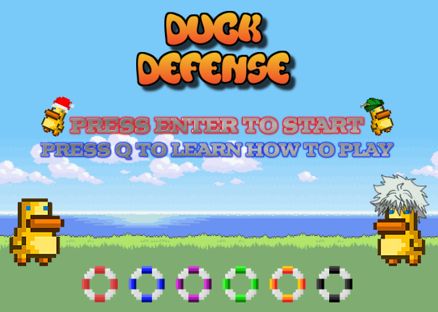
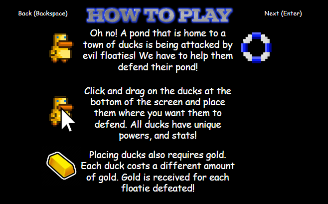

# Duck-Defense

  
  <h1 align= "center">Defend the city with the help of some mighty ducks! </h1>
 

Duck Defense is a Tower Defense Game with all sorts of towers with different abilities!

Game inspired by Bloons Tower Defense and was crafted using Java Game Library LibGDX.

## What is Duck-Defense?
Waves of floaties spawn and you must place the mighty ducks in order to stop them from invading at all costs!
Different floaties have different abilities, but Duck City also has different types of ducks to help defend the city!

## How To Play!

## Functionality of the game
Specific pathways for floaties and specific placement spots for the mighty Ducks!

### Valid Paths: 

### Invalid Paths: 

Each duck has its own personal abilities with different costs and benefits!

